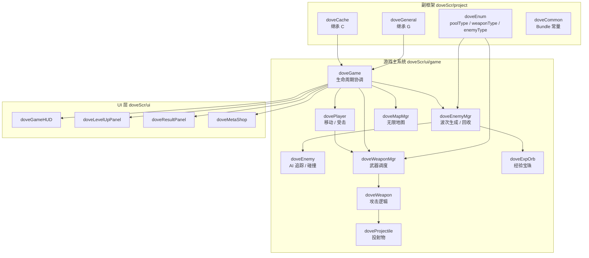
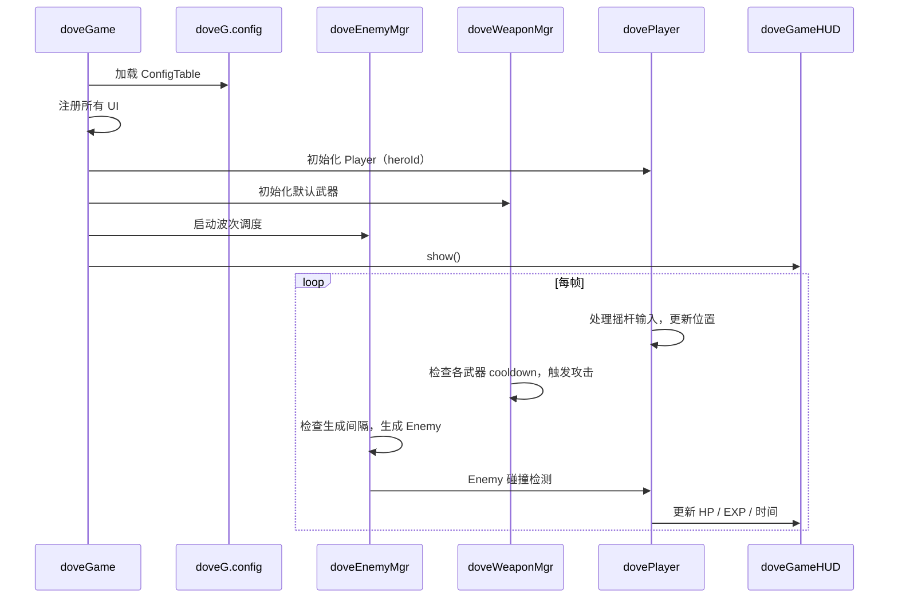
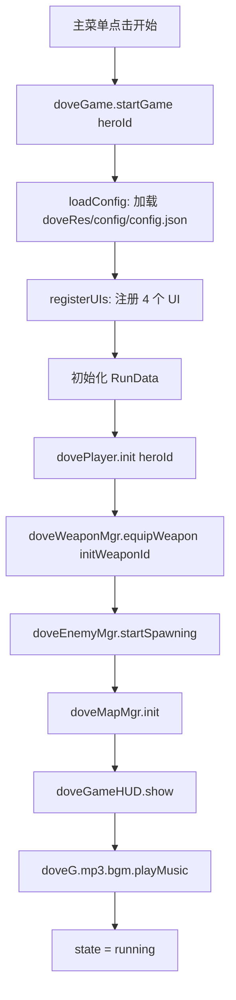
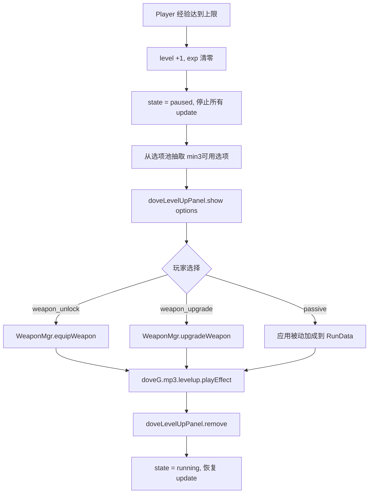
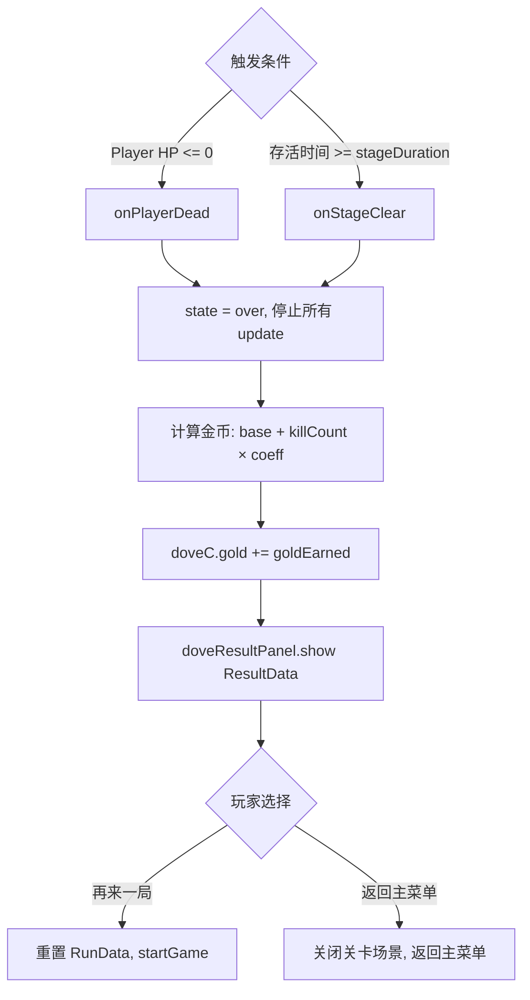

# 设计文档：dove-roguelite

## 概览

本项目基于 appDL 框架（Cocos Creator 3.x）开发一款参考《吸血鬼幸存者》风格的 Roguelite 游戏。玩家操控角色在无限滚动地图中自动攻击敌人、收集经验升级、选择技能强化，关卡结束后用金币解锁永久强化，形成局外成长循环。

核心设计原则：
- **框架只读**：`assets/appDL/` 下所有文件严禁修改，所有扩展通过继承/组合在 `assets/doveScr/project/` 中实现
- **统一入口**：dove 项目所有脚本使用 `doveG`（非 `G`）和 `doveC`（非 `C`）访问框架能力
- **对象池优先**：Enemy、Projectile、ExpOrb 均通过 Pool 管理，避免频繁实例化

---

## 架构



### 关键流程时序



---

## 目录结构

```
assets/
├── appDL/                          # 框架（只读，严禁修改）
├── doveRes/                        # 资源 Bundle
│   ├── img/                        # 通用图片
│   ├── audio/                      # 音频（bgm.mp3, hit.mp3, die.mp3, levelup.mp3）
│   └── config/                     # 配置表（config.json）
├── doveUi/                         # 预制体 Bundle
│   ├── img/                        # 预制体专属图片
│   ├── doveGame.prefab
│   ├── dovePlayer.prefab
│   ├── doveEnemy.prefab
│   ├── doveProjectile.prefab
│   ├── doveExpOrb.prefab
│   ├── doveGameHUD.prefab
│   ├── doveLevelUpPanel.prefab
│   ├── doveResultPanel.prefab
│   └── doveMetaShop.prefab
└── doveScr/
    ├── project/                    # 副框架（项目级扩展）
    │   ├── doveGeneral.ts          # 继承 G，导出 doveG
    │   ├── doveCache.ts            # 继承 C，导出 doveC
    │   ├── doveCommon.ts           # Bundle 名称常量
    │   └── doveEnum.ts             # 项目专属枚举
    └── ui/                         # 功能脚本
        ├── game/
        │   ├── doveGame.ts
        │   ├── dovePlayer.ts
        │   ├── doveEnemy.ts
        │   ├── doveEnemyMgr.ts
        │   ├── doveWeapon.ts
        │   ├── doveWeaponMgr.ts
        │   ├── doveProjectile.ts
        │   ├── doveExpOrb.ts
        │   └── doveMapMgr.ts
        ├── hud/
        │   └── doveGameHUD.ts
        ├── levelup/
        │   └── doveLevelUpPanel.ts
        ├── result/
        │   └── doveResultPanel.ts
        └── shop/
            └── doveMetaShop.ts
```

---

## 组件与接口

### 副框架设计

#### doveCommon.ts — Bundle 名称常量

```typescript
export const BUNDLE_UI  = "doveUi";
export const BUNDLE_RES = "doveRes";
```

#### doveEnum.ts — 项目专属枚举

```typescript
/** 对象池类型（扩展 appDL 的 poolType） */
export enum dovePoolType {
    enemy      = "dove_enemy",
    projectile = "dove_projectile",
    expOrb     = "dove_expOrb",
}

/** 武器类型 */
export enum weaponType {
    projectile = "projectile",  // 投射型
    aoe        = "aoe",         // 范围型
    orbit      = "orbit",       // 轨道型
}

/** 敌人类型 */
export enum enemyType {
    normal = "normal",   // 普通敌人
    fast   = "fast",     // 快速敌人
    tank   = "tank",     // 坦克敌人
    boss   = "boss",     // Boss
}

/** 游戏状态 */
export enum gameState {
    idle     = "idle",
    running  = "running",
    paused   = "paused",
    over     = "over",
}

/** 缓存 Key（dove 项目专属） */
export enum doveCKey {
    metaData = "dove_metaData",
}
```

#### doveGeneral.ts — 全局入口

```typescript
import G from "../../appDL/General/General";
import { RunData, MetaData } from "../ui/game/doveGame";

class DoveGeneral extends G {
    /** 当前局运行时数据（内存级，不持久化） */
    public static runData: RunData = null;
}

export default class doveG extends DoveGeneral {}
declare global { var doveG: typeof DoveGeneral }
globalThis["doveG"] = doveG;
```

#### doveCache.ts — 缓存入口

```typescript
import C from "../../appDL/Manager/CacheMgr";
import { doveCKey } from "./doveEnum";
import { MetaData } from "../ui/game/doveGame";

class DoveCache extends C {
    static signKey = "dove";

    /** 金币总量快捷属性 */
    static get gold(): number {
        return this.get(doveCKey.metaData, "gold") ?? 0;
    }
    static set gold(v: number) {
        this.set(doveCKey.metaData, v, "gold");
    }

    /** 局外强化等级表快捷属性 */
    static get metaUpgrades(): Record<string, number> {
        return this.get(doveCKey.metaData, "upgrades") ?? {};
    }
    static set metaUpgrades(v: Record<string, number>) {
        this.set(doveCKey.metaData, v, "upgrades");
    }
}

export default class doveC extends DoveCache {}
declare global { var doveC: typeof DoveCache }
globalThis["doveC"] = doveC;
```

---

### 核心模块设计

#### doveGame.ts — 游戏主系统

职责：协调各子系统初始化、生命周期管理、关卡启动/结束流程。

```typescript
@ccclass('doveGame')
export class doveGame extends Component {
    private state: gameState = gameState.idle;
    private elapsedTime: number = 0;
    private killCount: number = 0;

    /** 关卡启动入口，由主菜单携带 heroId 调用 */
    async startGame(heroId: number): Promise<void>

    /** 暂停/恢复游戏逻辑 */
    pauseGame(): void
    resumeGame(): void

    /** 触发死亡流程 */
    onPlayerDead(): void

    /** 触发胜利流程（存活时间到） */
    onStageClear(): void

    /** 注册所有 dove UI */
    private registerUIs(): void

    /** 加载配置表 */
    private async loadConfig(): Promise<void>
}
```

#### dovePlayer.ts — 玩家角色

```typescript
@ccclass('dovePlayer')
export class dovePlayer extends Component {
    hp: number
    maxHp: number
    speed: number          // 来自 ConfigTable.hero[heroId].speed
    pickupRadius: number   // 来自 ConfigTable.hero[heroId].pickupRadius

    /** 接收摇杆输入，更新移动方向 */
    setJoystickDir(dir: Vec2): void

    /** 每帧更新位置 */
    update(dt: number): void

    /** 受到伤害 */
    takeDamage(dmg: number): void

    /** 获取面向最近 Enemy 的方向向量 */
    getFacingDir(enemies: Node[]): Vec2
}
```

#### doveEnemyMgr.ts — 敌人管理器

```typescript
@ccclass('doveEnemyMgr')
export class doveEnemyMgr extends Component {
    private activeEnemies: Node[] = []
    private spawnTimer: number = 0

    /** 启动波次调度 */
    startSpawning(): void

    /** 每帧检查生成 */
    update(dt: number): void

    /** 在 Player 视口外随机位置生成一批敌人 */
    private spawnWave(wave: WaveConfig): void

    /** Enemy 死亡回调：生成 ExpOrb，归还 Pool */
    onEnemyDead(enemyNode: Node, pos: Vec3): void

    /** 获取当前所有活跃 Enemy 节点列表 */
    getActiveEnemies(): Node[]
}
```

#### doveEnemy.ts — 敌人单位

```typescript
@ccclass('doveEnemy')
export class doveEnemy extends Component {
    hp: number
    maxHp: number
    speed: number
    damage: number
    contactCooldown: number = 0   // 接触伤害冷却计时

    init(cfg: EnemyConfig): void
    update(dt: number): void      // 向 Player 移动，检测碰撞
    takeDamage(dmg: number): void
}
```

#### doveWeaponMgr.ts — 武器管理器

```typescript
@ccclass('doveWeaponMgr')
export class doveWeaponMgr extends Component {
    private weapons: doveWeapon[] = []

    /** 装备武器（返回是否成功） */
    equipWeapon(weaponId: number): boolean

    /** 升级已装备武器 */
    upgradeWeapon(weaponId: number): void

    /** 每帧驱动所有武器 cooldown 计时 */
    update(dt: number): void

    /** 获取当前武器列表（用于 LevelUpPanel 选项过滤） */
    getEquippedWeaponIds(): number[]
}
```

#### doveWeapon.ts — 武器基类

```typescript
@ccclass('doveWeapon')
export class doveWeapon extends Component {
    weaponId: number
    type: weaponType
    level: number = 1
    cooldown: number       // 来自 ConfigTable.weapon[weaponId].cooldown
    private cooldownTimer: number = 0

    update(dt: number): void   // 计时，到达 cooldown 时调用 fire()
    fire(playerPos: Vec3, targetDir: Vec2): void  // 子类实现
}
```

#### doveMapMgr.ts — 地图管理器

```typescript
@ccclass('doveMapMgr')
export class doveMapMgr extends Component {
    readonly CHUNK_SIZE = 512          // 分块尺寸（像素）
    private chunks: Node[][] = []      // 3×3 网格

    init(): void
    update(dt: number): void           // 检测 Player 位置，触发分块循环
    private recycleChunk(chunk: Node, newGridPos: Vec2): void
}
```

#### doveGameHUD.ts — 游戏内 HUD

```typescript
@ccclass('doveGameHUD')
export class doveGameHUD extends UIScr {
    updateHP(cur: number, max: number): void
    updateTime(seconds: number): void       // 格式化为 MM:SS
    updateKillCount(count: number): void
    updateExpBar(cur: number, max: number, level: number): void
    showDamageFloat(worldPos: Vec3, dmg: number): void
}
```

#### doveLevelUpPanel.ts — 升级选择面板

```typescript
@ccclass('doveLevelUpPanel')
export class doveLevelUpPanel extends UIScr {
    onShow(): void   // data: LevelUpOption[]，渲染 3 个选项卡
    private onSelectOption(option: LevelUpOption): void
}
```

#### doveResultPanel.ts — 结算面板

```typescript
@ccclass('doveResultPanel')
export class doveResultPanel extends UIScr {
    onShow(): void   // data: ResultData，展示战绩
    private onReplay(): void
    private onBackHome(): void
}
```

#### doveMetaShop.ts — 局外商店

```typescript
@ccclass('doveMetaShop')
export class doveMetaShop extends UIScr {
    onShow(): void
    private onUpgrade(upgradeId: string): void   // 检查金币，扣除，持久化
    private refreshGold(): void                   // 由 doveC.watch 驱动
}
```

---

## 数据模型

### RunData — 单局运行时数据（内存级，不持久化）

```typescript
interface RunData {
    heroId: number              // 选中角色 ID
    level: number               // 当前等级，初始 1
    exp: number                 // 当前经验值
    expToNext: number           // 升级所需经验
    hp: number                  // 当前生命值
    maxHp: number               // 最大生命值
    speed: number               // 当前移速（含局外加成）
    elapsedTime: number         // 已存活秒数
    killCount: number           // 击杀总数
    goldEarned: number          // 本局获得金币
    equippedWeaponIds: number[] // 已装备武器 ID 列表
}
```

### MetaData — 局外持久化数据（通过 doveC 存储）

```typescript
interface MetaData {
    gold: number                        // 金币总量
    upgrades: Record<string, number>    // 强化项 ID -> 当前等级，例如 { "hp_up": 2, "spd_up": 1 }
}
```

### ConfigTable — 配置表结构（从 doveRes/config/config.json 加载）

```typescript
interface ConfigTable {
    hero: HeroConfig[]
    enemy: EnemyConfig[]
    weapon: WeaponConfig[]
    upgrade: UpgradeConfig[]
    wave: WaveConfig[]
    stage: StageConfig
}

interface HeroConfig {
    id: number
    name: string
    maxHp: number
    speed: number           // 像素/秒
    pickupRadius: number    // 经验拾取半径（像素）
    initWeaponId: number    // 初始武器 ID
}

interface EnemyConfig {
    id: number
    type: enemyType
    maxHp: number
    speed: number
    damage: number          // 接触伤害
    expDrop: number         // 掉落经验值（每个 ExpOrb）
    expOrbCount: [number, number]  // 掉落 ExpOrb 数量范围 [min, max]
}

interface WeaponConfig {
    id: number
    name: string
    type: weaponType
    cooldown: number        // 攻击间隔（秒）
    damage: number
    maxLevel: number
    aoeRadius?: number      // 仅 AOE 类型
    orbitRadius?: number    // 仅 Orbit 类型
    projectileSpeed?: number
    projectileRange?: number
}

interface UpgradeConfig {
    id: string
    name: string
    desc: string
    maxLevel: number
    costPerLevel: number[]  // 每级升级费用，长度 = maxLevel
    effect: {
        type: "hp" | "speed" | "exp" | "damage" | "cooldown"
        valuePerLevel: number  // 每级加成值（百分比或绝对值）
    }
}

interface WaveConfig {
    time: number            // 触发时间（秒）
    enemyType: enemyType
    count: number
    spawnInterval: number   // 本波生成间隔（秒）
}

interface StageConfig {
    duration: number        // 关卡时长（秒）
    maxEnemyCount: number   // 场景最大敌人数
    maxWeaponSlots: number  // 最大武器槽数，默认 6
    decorDensity: number    // 装饰物密度（0~1）
    goldBaseReward: number  // 基础金币奖励
    goldKillCoeff: number   // 击杀金币系数
}

interface LevelUpOption {
    type: "weapon_unlock" | "weapon_upgrade" | "passive"
    weaponId?: number
    upgradeId?: string
    name: string
    desc: string
    iconPath: string
}

interface ResultData {
    elapsedTime: number
    killCount: number
    finalLevel: number
    goldEarned: number
}
```

---

## UI 注册清单

在 `doveGame.ts` 的 `registerUIs()` 方法中统一注册：

```typescript
private registerUIs() {
    UIMgr.register(new UIClass({
        ID: "doveGameHUD",
        parfabPath: "doveGameHUD",
        bundleName: BUNDLE_UI,
        fullScreen: true,
        animBool: false,
    }));
    UIMgr.register(new UIClass({
        ID: "doveLevelUpPanel",
        parfabPath: "doveLevelUpPanel",
        bundleName: BUNDLE_UI,
        fullScreen: false,
        animBool: true,
        group: "popup",
    }));
    UIMgr.register(new UIClass({
        ID: "doveResultPanel",
        parfabPath: "doveResultPanel",
        bundleName: BUNDLE_UI,
        fullScreen: true,
        animBool: true,
    }));
    UIMgr.register(new UIClass({
        ID: "doveMetaShop",
        parfabPath: "doveMetaShop",
        bundleName: BUNDLE_UI,
        fullScreen: true,
        animBool: true,
    }));
}
```

| UI ID | fullScreen | animBool | group | 说明 |
|---|---|---|---|---|
| doveGameHUD | true | false | — | 游戏内 HUD，无动画避免闪烁 |
| doveLevelUpPanel | false | true | popup | 升级弹窗，同组只显示最新 |
| doveResultPanel | true | true | — | 结算全屏，覆盖 HUD |
| doveMetaShop | true | true | — | 局外商店全屏 |

---

## 对象池类型枚举

`doveEnum.ts` 中的 `dovePoolType` 扩展 appDL 的对象池体系（不修改 `poolType` 枚举，直接使用字符串 key）：

```typescript
export enum dovePoolType {
    enemy      = "dove_enemy",
    projectile = "dove_projectile",
    expOrb     = "dove_expOrb",
}
```

使用示例：

```typescript
// 取出
const enemyNode = Pool.getPoolName(dovePoolType.enemy as any, enemyPrefab);
// 回收
Pool.putPool(enemyNode, dovePoolType.enemy as any);
```

---

## 关键流程

### 关卡启动流程



### 升级选择流程



### 关卡结算流程



---

## 正确性属性

*属性（Property）是在系统所有合法执行路径上都应成立的特征或行为——本质上是对系统应做什么的形式化陈述。属性是人类可读规格说明与机器可验证正确性保证之间的桥梁。*

### 属性 1：Player 移动位移正确性

*对任意* 摇杆方向向量（单位向量）和帧时间 dt，Player 每帧位移量应等于 `speed × dt × direction`，误差不超过浮点精度。

**验证：需求 3.2**

---

### 属性 2：Player 始终面向最近 Enemy

*对任意* Enemy 列表（至少 1 个），`dovePlayer.getFacingDir(enemies)` 返回的方向向量应指向距离 Player 最近的 Enemy，与暴力枚举结果一致。

**验证：需求 3.4**

---

### 属性 3：Enemy 生成位置在视口外

*对任意* Player 位置和视口尺寸，`doveEnemyMgr` 生成的所有 Enemy 初始位置应在视口范围之外（距 Player 中心距离 > 视口对角线半径）。

**验证：需求 4.1**

---

### 属性 4：Enemy 生成间隔符合配置

*对任意* `spawnInterval` 配置值和模拟时间 T，`doveEnemyMgr` 触发生成检查的次数应等于 `floor(T / spawnInterval)`，误差不超过 1 次。

**验证：需求 4.2**

---

### 属性 5：Enemy 每帧靠近 Player

*对任意* Enemy 位置和 Player 位置（两者不重合），执行一帧 update 后，Enemy 与 Player 的距离应严格小于更新前的距离。

**验证：需求 4.4**

---

### 属性 6：Enemy 死亡掉落 ExpOrb 数量在配置范围内

*对任意* EnemyConfig（expOrbCount = [min, max]），触发 Enemy 死亡后，生成的 ExpOrb 数量应满足 `min <= count <= max`。

**验证：需求 4.6**

---

### 属性 7：超过 maxEnemyCount 时不生成新 Enemy

*对任意* `maxEnemyCount` 配置值，当场景内活跃 Enemy 数量 >= maxEnemyCount 时，触发生成检查后活跃 Enemy 数量不应增加。

**验证：需求 4.7**

---

### 属性 8：武器按 cooldown 触发攻击

*对任意* 武器 cooldown 值和模拟时间 T，武器触发攻击的次数应等于 `floor(T / cooldown)`，误差不超过 1 次。

**验证：需求 5.2**

---

### 属性 9：投射型武器方向指向最近 Enemy

*对任意* Enemy 列表（至少 1 个），投射型武器触发后生成的 Projectile 初始方向应指向距 Player 最近的 Enemy，与暴力枚举结果一致。

**验证：需求 5.3**

---

### 属性 10：AOE 武器只伤害范围内 Enemy

*对任意* Enemy 列表和 AOE 半径，触发 AOE 后，只有距 Player 中心距离 <= aoeRadius 的 Enemy 应受到伤害，范围外的 Enemy 生命值不变。

**验证：需求 5.4**

---

### 属性 11：轨道型武器 Projectile 与 Player 保持固定距离

*对任意* 轨道半径配置，轨道型武器生成的所有 Projectile 在任意时刻与 Player 中心的距离应等于 `orbitRadius`，误差不超过 1 像素。

**验证：需求 5.5**

---

### 属性 12：ExpOrb 拾取后经验值正确增加

*对任意* ExpOrb 经验值和 Player 初始经验，Player 进入拾取范围后，经验值应增加对应量，且 ExpOrb 节点被回收（不再活跃）。

**验证：需求 6.1**

---

### 属性 13：LevelUpPanel 抽取选项数量正确且无重复

*对任意* 可用选项池（大小 N），LevelUpPanel 抽取的选项数量应等于 `min(3, N)`，且抽取结果中无重复选项。

**验证：需求 6.4, 6.6**

---

### 属性 14：地图分块循环后总数保持 9

*对任意* Player 移动方向和距离（超过一个分块），`doveMapMgr` 执行分块循环后，活跃分块总数应始终等于 9。

**验证：需求 7.2**

---

### 属性 15：装饰物不与 Player/Enemy 重叠

*对任意* Player 位置和 Enemy 列表，`doveMapMgr` 生成的所有装饰物位置与 Player 及所有 Enemy 的碰撞半径不应重叠。

**验证：需求 7.4**

---

### 属性 16：时间格式化为 MM:SS

*对任意* 非负整数秒数 s（0 <= s <= 5999），`doveGameHUD.updateTime(s)` 输出的字符串应匹配正则 `^\d{2}:\d{2}$`，且分钟和秒数数值正确。

**验证：需求 8.2**

---

### 属性 17：结算面板数据与 RunData 一致

*对任意* RunData，`doveResultPanel` 展示的存活时间、击杀数、最终等级、获得金币应与 RunData 中对应字段完全一致。

**验证：需求 9.2**

---

### 属性 18：金币奖励计算正确

*对任意* 击杀数 killCount、基础金币 base 和系数 coeff，关卡结算后 `doveC.gold` 的增量应等于 `base + killCount × coeff`，且累加后总量正确。

**验证：需求 9.3**

---

### 属性 19：MetaShop 金币购买正确性

*对任意* 当前金币总量和升级费用，若金币 >= 费用则升级成功（金币减少正确，等级 +1，doveC 持久化更新）；若金币 < 费用则升级被拒绝（金币不变，等级不变）。

**验证：需求 10.2, 10.3, 10.4**

---

### 属性 20：金币变化时 MetaShop 顶部显示自动刷新

*对任意* 金币变化操作，通过 `doveC.watch` 注册的回调应被触发，MetaShop 顶部金币显示值应等于 `doveC.gold` 的最新值。

**验证：需求 10.6**

---

### 属性 21：MetaData 持久化正确性

*对任意* MetaData 写入操作，调用 `doveC.set` 后，从 `localStorage` 读取对应 key 的值应与写入值完全一致（JSON 序列化往返）。

**验证：需求 12.1**

---

## 错误处理

| 场景 | 处理策略 |
|---|---|
| `doveRes/config/config.json` 加载失败 | 使用内置默认配置，控制台输出 `console.warn`，游戏继续运行 |
| `localStorage` 读取失败（如隐私模式） | 使用默认 MetaData（gold=0, upgrades={}），控制台输出 `console.warn` |
| `localStorage` 写入失败 | 捕获异常，控制台输出 `console.error`，内存数据保持正确 |
| Pool 取出节点为 null（Prefab 未加载） | 记录 `console.error`，跳过本次生成，不崩溃 |
| 武器槽已满时尝试装备 | `equipWeapon` 返回 false，GameHUD 显示"武器槽已满"提示 |
| LevelUpPanel 可用选项为 0 | 不打开面板，直接恢复游戏（极端情况，所有武器和强化均已满级） |
| Enemy 数量超过 maxEnemyCount | EnemyMgr 暂停生成，不报错，数量降低后自动恢复 |

---

## 测试策略

### 双轨测试方法

本项目采用**单元测试 + 属性测试**双轨并行的测试策略，两者互补：
- **单元测试**：验证具体示例、边界条件、集成点
- **属性测试**：通过随机输入验证普遍性规律，覆盖单元测试难以穷举的输入空间

### 属性测试配置

- 测试库：**fast-check**（TypeScript 原生支持，与 Cocos Creator 测试环境兼容）
- 每个属性测试最少运行 **100 次**迭代
- 每个属性测试必须包含注释标注对应设计属性：
  ```typescript
  // Feature: dove-roguelite, Property 1: Player 移动位移正确性
  fc.assert(fc.property(...), { numRuns: 100 });
  ```

### 单元测试重点

- 具体示例：默认角色选择（需求 2.4）、升级触发（需求 6.3）、关卡结算触发（需求 9.1）
- 集成点：doveGame 初始化流程（需求 1.2~1.4）、MetaShop 购买流程（需求 10.4）
- 边界条件：localStorage 读取失败（需求 12.5）、武器槽已满（需求 5.7）

### 属性测试重点（对应正确性属性）

每个正确性属性对应一个属性测试，使用 fast-check 生成器：

```typescript
// 属性 1：Player 移动位移
fc.assert(fc.property(
    fc.float({ min: -1, max: 1 }),  // dir.x
    fc.float({ min: -1, max: 1 }),  // dir.y
    fc.float({ min: 0.01, max: 0.1 }),  // dt
    (dx, dy, dt) => {
        const dir = new Vec2(dx, dy).normalize();
        const result = calcMoveDelta(dir, SPEED, dt);
        return Math.abs(result.length() - SPEED * dt) < 0.001;
    }
), { numRuns: 100 });
// Feature: dove-roguelite, Property 1: Player 移动位移正确性
```

### 不可自动化测试项

以下需求依赖人工验证：
- 所有 UI 视觉展示（角色选择高亮、血条渲染、飘字动画等）
- 摄像机跟随效果（需求 3.5）
- 音频播放效果（需求 11.1~11.4 的实际音频输出）
- 暂停菜单交互（需求 8.6）
